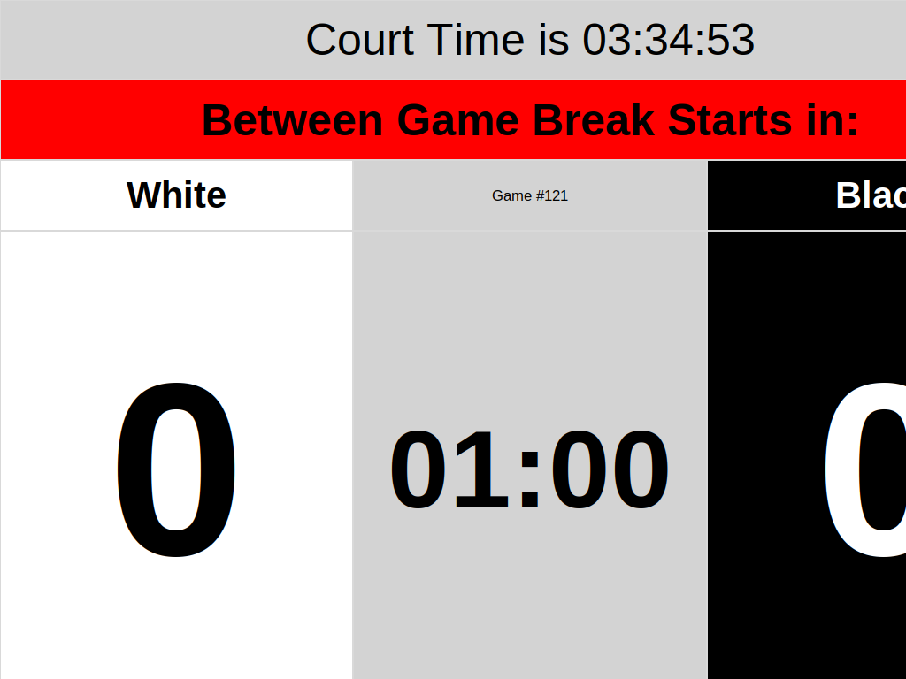
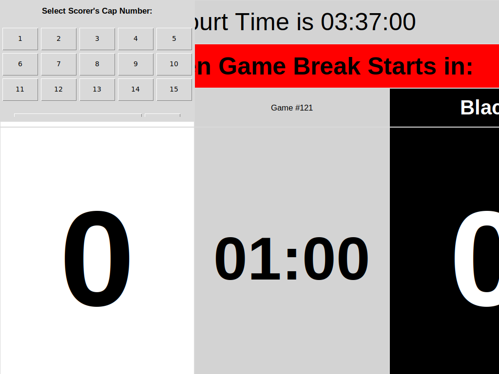

# Record Scorers Cap Number Feature

## Overview

This feature adds the ability to record which player (by cap number) scored each goal. When enabled, a dialog prompts the user to select the scorer's cap number (1-15) or mark it as "Unknown" each time a goal is added.

## Implementation Details

### 1. Settings Integration

A new checkbox "Record Scorers Cap Number" has been added to the Game Variables tab, positioned above the Crib Time setting as specified in the requirements.

**Location**: Game Variables tab → Above Crib Time listing

**Default State**: Unchecked (disabled)

**Persistence**: State is stored in `settings.json` under `gameSettings.record_scorers_cap_number`

### 2. Cap Number Selection Dialog

When the checkbox is enabled and a goal is scored, a modal dialog appears with the following layout:

```
┌─────────────────────────────────────┐
│  Select Scorer's Cap Number:       │
│                                     │
│  ┌─────────────────────────────┐   │
│  │ [1]  [2]  [3]  [4]  [5]     │   │
│  │ [6]  [7]  [8]  [9]  [10]    │   │
│  │ [11] [12] [13] [14] [15]    │   │
│  └─────────────────────────────┘   │
│                                     │
│  [   Unknown   ] [OK]               │
│   (colspan 1-4)  (col 5)            │
└─────────────────────────────────────┘
```

**Button Layout**:
- 5×3 matrix of identically sized buttons labeled 1-15
- "Unknown" button spans columns 1-4 below the matrix
- "OK" button in column 5 below the matrix

**User Interaction**:
1. Click a cap number button (1-15) or "Unknown"
2. Selected button is highlighted (sunken appearance with light blue background)
3. Click "OK" to confirm selection
4. If no selection is made and OK is clicked, a warning dialog appears
5. If dialog is closed/canceled without clicking OK, the goal is **not added**

### 3. CSV Data Logging

The `UWH_Game_Data.csv` file now includes a `cap_number` column that records:
- The selected cap number (1-15) for each goal
- "Unknown" if the scorer is unknown
- Empty string if the feature is disabled

**CSV Format**:
```csv
local_datetime,court_time,event_type,team,cap_number,duration
2025-10-04 12:30:45,00:15:23,Goal,White,5,
2025-10-04 12:32:10,00:16:48,Goal,Black,Unknown,
2025-10-04 12:35:00,00:19:38,Goal,White,,
```

### 4. Code Changes

**Modified Files**:
- `uwh.py`: Main application file

**Key Changes**:

1. **Variable Definition** (lines ~234-248):
   ```python
   "record_scorers_cap_number": {
       "default": False, 
       "checkbox": True, 
       "unit": "", 
       "label": "Record Scorers Cap Number"
   }
   ```

2. **Checkbox Initialization** (line ~326):
   ```python
   self.record_scorers_cap_number_var = tk.BooleanVar(
       value=self.variables["record_scorers_cap_number"]["default"]
   )
   ```

3. **Settings Tab Layout** (lines ~861-910):
   - Checkbox inserted before Crib Time in the variable order
   - Special handling similar to team_timeouts_allowed and overtime_allowed

4. **Cap Number Dialog** (new method `show_cap_number_dialog`):
   - Creates modal dialog with specified layout
   - Returns selected cap number or None if canceled

5. **Goal Addition Logic** (modified `add_goal_with_confirmation`):
   ```python
   # Get cap number if recording is enabled
   cap_number = None
   if self.record_scorers_cap_number_var.get():
       cap_number = self.show_cap_number_dialog()
       if cap_number is None:
           return  # Cancel goal addition
   
   score_var.set(score_var.get() + 1)
   self.log_game_event("Goal", team=team_name, cap_number=cap_number)
   ```

6. **CSV Logging** (`log_game_event` method):
   - Already had `cap_number` parameter
   - Now populated when goals are scored with recording enabled

## Usage Instructions

### Enabling the Feature

1. Open the application
2. Navigate to the "Game Variables" tab
3. Locate the "Record Scorers Cap Number" checkbox (above Crib Time)
4. Check the box to enable cap number recording
5. The setting is automatically saved to `settings.json`

### Scoring a Goal with Cap Number

1. Ensure "Record Scorers Cap Number" is checked in Game Variables
2. Click "Add Goal White" or "Add Goal Black" on the Scoreboard tab
3. A dialog appears prompting for the scorer's cap number
4. Click the appropriate cap number button (1-15) or "Unknown"
5. Click "OK" to confirm and add the goal
6. The goal is logged to `UWH_Game_Data.csv` with the selected cap number

### Disabling the Feature

1. Navigate to the "Game Variables" tab
2. Uncheck the "Record Scorers Cap Number" checkbox
3. Goals will be added without prompting for cap numbers

## Testing

All manual tests have been performed and validated:

✓ Checkbox appears in correct position (above Crib Time)
✓ Checkbox state persists in settings.json
✓ Dialog displays with correct layout (5×3 + Unknown + OK)
✓ Selected button is highlighted
✓ OK button confirms selection
✓ Canceling dialog prevents goal from being added
✓ Cap numbers are logged correctly to CSV
✓ Feature can be enabled/disabled
✓ Works with both teams (White/Black)

## Screenshots

### Settings Tab with Checkbox


### Cap Number Selection Dialog


## Notes

- The feature is **disabled by default** to maintain backward compatibility
- Cap number recording is optional - users must explicitly enable it
- If the dialog is canceled (closed without selecting OK), the goal is NOT added
- Cap numbers 1-15 cover standard team sizes
- "Unknown" option handles cases where the scorer cannot be identified
- The CSV format is backward compatible - existing tools can ignore the cap_number column
