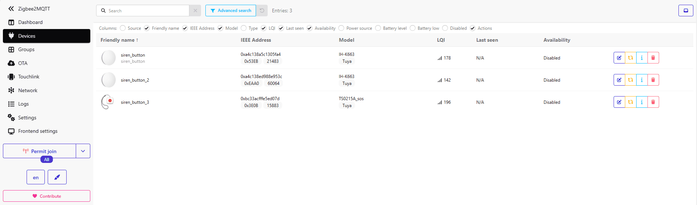

# Underwater Hockey Scoring Desk Kit

A project to allow the use of a computer, modern computer languages and readily available Arduino hardware to make a scoring and siren system for Underwater Hockey.

**This README is the user manual for the software.** It combines installation, normal operation, tournament files, two-court results synchronisation, screens, sounds and Zigbee siren setup in one place. The separate `MAINTAINERS.md` is for people modifying the Python source.

The hardware is still being developed. The current `HARDWARE_SETUP.md` remains a separate working hardware note for now; when the production hardware is settled, its relevant material can be folded into this manual as a hardware chapter.

The software has an operator-facing Underwater Hockey Game Management App and player-facing or spectator-facing Display Window(s). The operator window opens on **Game Variables**, with four other main tabs: **Scoreboard**, **Screens**, **Sounds**, and **Zigbee Siren**.

## Contents

- [How the application works](#how-the-application-works)
- [Known working setups](#known-working-setups)
- [Windows 11 installation](#downloading-and-installing-uwh-on-windows)
- [Raspberry Pi 5 installation](#downloading-and-installing-uwh-on-a-raspberry-pi-5)
- [Game Variables tab](#game-variables-tab)
- [Tournament List](#tournament-list)
- [Game Sequence](#game-sequence)
- [Two-court tournament results synchronisation](#two-court-tournament-results-synchronisation)
- [Screens tab](#screens-tab)
- [Sounds tab](#sounds-tab)
- [Scoreboard tab](#scoreboard-tab)
- [Other game behaviour](#other-game-behaviour)
- [Zigbee2MQTT wireless siren setup and operation](#zigbee2mqtt-wireless-siren-setup-and-operation)
- [Other installation and packaging notes](#other-installation-and-packaging-notes)

## How the application works

UWH separates **match setup**, **live match control**, **public display**, **audio**, and **optional wireless control** so the operator can configure a game before play and then work mainly from the Scoreboard tab.

A normal operating flow is:

1. Start UWH and allow the startup self-test to complete.
2. In **Game Variables**, load a preset or enter the match timings and rules. If a tournament draw is being used, select the draw and starting game.
3. In **Screens**, select the operator layout and open the required player/spectator Display Window(s). Use **Auto Detect Screens** and **Test Displays** when setting up a new computer or monitor arrangement.
4. In **Sounds**, select and test the siren and pip sounds, durations and volumes.
5. If wireless referee buttons are being used, configure and test them in **Zigbee Siren**. The wired Arduino siren button remains a separate local input path.
6. Use **Scoreboard** during the match for goals, penalties, team time-outs and manual timer control. The player/spectator Display Window follows the live match state.
7. At the end of a tournament game, UWH saves the completed result to the separate results CSV before clearing the live match and advancing to the next selected game. If shared two-court sync is enabled, the local save happens first and network upload happens afterwards in the background.

The game clock progresses through First Half, Half Time and Second Half, with optional Overtime and Sudden Death when enabled. The detailed sequence and the special rules for goals scored during breaks are described later in this manual.

## Known working setups

## Windows 11: tested configuration (September 2026)

The Windows 11 UWH application, wired Arduino siren, Mosquitto MQTT broker and Zigbee2MQTT have been tested together with **up to three working Zigbee buttons** on one coordinator. Observed button actions include `single`, `double`, `hold` and `emergency`; **which action each button sends depends on its model**, and UWH's per-button Action Mapping determines the siren response. Zigbee2MQTT was also confirmed to restart through PM2 and Windows Task Scheduler after a Windows reboot. See [the Zigbee section](#zigbee2mqtt-wireless-siren-setup-and-operation) for installation and button-mapping instructions. Do not re-pair a working button to a second coordinator just to share it with another UWH computer.

## Raspberry Pi 5: tested configuration (September 2026)

Raspberry Pi OS Desktop based on Debian 12 Bookworm (listed as Raspberry Pi OS Legacy), Python 3.11, and the X11 desktop session. Two maximised displays, mouse movement, game timers and score updates have been tested on this combination. A complete Raspberry Pi Zigbee2MQTT/Mosquitto installation has **not** been independently verified in the same way as the Windows setup.

Why X11 matters for this application: On the tested Pi 5, moving the pointer over Game Variables checkboxes under Wayland caused GPU utilisation to reach about 98% and the mouse became jerky. A separate note: Raspberry Pi recommends Wayland generally, but X11 was demonstrably better for this GUI.

> [!IMPORTANT]
> **Recommended Pi 5 configuration:** Stay with **Bookworm + X11** until a different combination has been tested with UWH. Raspberry Pi recommends Wayland generally, but X11 was demonstrably better for the Scoring Desk Kit's GUI performance on Bookworm.

#### Select X11 on Raspberry Pi OS
1. Open Terminal and run `sudo raspi-config`.
2. Select **6 Advanced Options** → **A7 Wayland** → **W1 X11**.
3. Select Finish and reboot when prompted.
4. After reboot, run:
   ```bash
   echo $XDG_SESSION_TYPE
   ```
   It should print `x11`. If it prints `wayland`, check the selection and reboot again. To switch back later, use **W2 Labwc** in the same menu.

## Downloading and installing UWH on Windows

### Download the program
1. Open the UWH Scoring Desk Kit repository on GitHub.
2. On the right-hand side of the repository page, find **Releases**.
3. Click Releases, then select the latest release.
4. Scroll down to the **Assets** section.
5. Click the Windows ZIP file. Its name will resemble: `UnderwaterHockeyScoringDesk-v1.2.123-Windows.zip`
   (The version and build numbers will vary.)
6. The ZIP file will download to your computer, normally into your Downloads folder.

> [!IMPORTANT]
> Do not select **Source code (zip)** or use the green **Code → Download ZIP** button. Those download the Python source code, not the ready-to-run Windows application.

### Extract the program
1. Open Windows File Explorer and navigate to Downloads.
2. Right-click the downloaded ZIP file.
3. Select **Extract All...**
4. Choose a permanent folder, such as `Documents\UWH Scoring Desk`.
5. Click Extract.

The extracted folder contains `UnderwaterHockeyScoringDesk.exe` and its supporting files. Keep these together.

### Run the application
1. Open the extracted folder.
2. Double-click `UnderwaterHockeyScoringDesk.exe`.
3. The startup self-test will run before the application opens.
4. The Game Management window will appear.
5. Use the **Screens** tab's **Display Screen Options** to open a player-facing or crowd-facing display, if required. Choose a supported Standard or Widescreen layout. Closing a Display Window with its **X** closes it and queues the closed state for the next automatic settings save (about one minute after the first change, or on normal program exit). Check your monitor assignments with **Auto Detect Screens** and **Test Displays**.

You can create a desktop shortcut by right-clicking the executable and selecting **Show more options → Send to → Desktop (create shortcut)**.

### Installing future updates

Download the newer release and extract it into a **separate folder** first. Do not overwrite a working installation without a backup.

> [!WARNING]
> **Back up `settings.json` before every update.** It includes your **Zigbee button-name list** (for example, `siren_button, siren_button_2, siren_button_3`), MQTT settings, sound preferences, screen layout and the remembered Display Window open/closed state. Back up tournament CSVs, custom sounds under `assets/`, and game logs too. Replacing UWH's settings can lose button names **or action mappings**, even though the buttons remain paired to Zigbee2MQTT.

After updating, confirm the **Zigbee Siren → Button Device Names** field and test every configured button and its action mapping before using the system at a match. The lower-right corner of the **Game Variables** panel shows the running UWH version so you can confirm which download is actually open. Windows release builds show the same `1.2.<build>` number used in the release ZIP name; source ZIPs show a source-build identifier. Do not blindly replace a new-format `settings.json` with a very old version; compare and carry forward your customised values where the format has changed. Zigbee2MQTT has a **separate** `data/` directory that should be backed up before Zigbee2MQTT updates; see [the Zigbee section](#zigbee2mqtt-wireless-siren-setup-and-operation).

## Downloading and installing UWH on a Raspberry Pi 5

These instructions are for a new installation from the Python source, not a standalone executable. A keyboard, mouse and Raspberry Pi OS Desktop are needed; the Lite edition does not include the graphical desktop.

### Raspberry Pi 5 power supply configurations

Raspberry Pi 5 can be powered in several ways, but the power source affects how much current the firmware makes available to the board and to USB peripherals. Raspberry Pi recommends a **5 V / 5 A** supply for full capability. A good **5 V / 3 A** supply can run a Pi 5, but the total current available to downstream USB peripherals is normally limited to **600 mA** instead of **1.6 A**.

| Power arrangement | Pi 5 behaviour | Required configuration |
|---|---|---|
| **UWH Scoring Desk production motherboard — 5.1 V / at least 5 A through the GPIO header** | No USB-C Power Delivery negotiation occurs. The motherboard provides the high-current 5 V rail directly. | **Set `PSU_MAX_CURRENT=5000` in the Pi 5 bootloader EEPROM.** |
| **Official Raspberry Pi 27 W USB-C supply, or another compatible USB-PD source that negotiates 5 V / 5 A** | The Pi detects the 5 A supply through USB-PD and automatically enables the higher power budget. | No `PSU_MAX_CURRENT` override is normally required. |
| **Good-quality 5 V / 3 A USB-C supply** | The Pi 5 can operate, but downstream USB power is normally limited to 600 mA. | Do **not** claim 5 A with `PSU_MAX_CURRENT=5000` unless the supply and complete power path really can provide it. |
| **Other verified 5 V / 5 A non-PD supply or bench supply connected through GPIO** | Electrically similar to the UWH GPIO-powered case: there is no USB-PD negotiation to report the available current. | `PSU_MAX_CURRENT=5000` may be used only when the source, wiring and connectors are genuinely capable of supplying 5 A. |

#### UWH Scoring Desk production hardware

> [!IMPORTANT]
> **The UWH Scoring Desk motherboard provides the Raspberry Pi 5 with a regulated 5.1 V supply capable of at least 5 A through the GPIO header. The dedicated PDM-Audio DC-DC supply uses the LMQ61460 regulator. The regulator specifies 3.5–7 ms from its first switching pulse to 90% of the selected output voltage, with a typical 0.7 ms enable-to-first-switching-pulse delay. This keeps the regulator's designed start-up to near operating voltage below 10 ms. The assembled production board should still be checked under load during hardware validation.**

The production motherboard feeds the Pi 5 through the **5 V GPIO power pins rather than through USB-C**. This deliberately bypasses USB-C Power Delivery negotiation. Most users are expected to provide their own Raspberry Pi 5, so each Pi fitted to the production motherboard must have its bootloader configured to recognise the available **5000 mA** supply.

For the UWH motherboard, edit the Pi 5 bootloader EEPROM configuration:

```bash
sudo rpi-eeprom-config --edit
```

Add or change:

```text
PSU_MAX_CURRENT=5000
```

Save the configuration and reboot:

```bash
sudo reboot
```

After rebooting, verify the setting:

```bash
rpi-eeprom-config | grep PSU_MAX_CURRENT
```

The result should include:

```text
PSU_MAX_CURRENT=5000
```

`PSU_MAX_CURRENT=5000` tells the Pi 5 firmware to **skip USB Power Delivery negotiation and assume that a 5 A source is available**. It does not increase the capability of the power supply itself. On the UWH motherboard this is appropriate because the dedicated PDM-Audio supply and its power path are designed for the Pi 5 load.

Raspberry Pi also provides a `usb_max_current_enable=1` setting that raises the USB peripheral limit from 600 mA to 1.6 A. **It does not need to be added separately for the UWH motherboard:** Raspberry Pi documents that this higher USB-current setting is enabled automatically when `PSU_MAX_CURRENT=5000` is set.

> [!CAUTION]
> **Do not use `PSU_MAX_CURRENT=5000` merely to remove a low-power warning.** Only use it when the complete 5 V supply path is genuinely capable of supplying 5 A. If a Pi 5 is removed from the UWH motherboard and later used with a lower-current supply, review or remove this EEPROM override. Also avoid connecting a second USB-C power supply while the Pi is already being powered from the UWH motherboard's GPIO 5 V rail.

#### If the Pi 5 is powered through USB-C instead

A Pi 5 supplied from an official Raspberry Pi 27 W USB-C supply negotiates **5 V / 5 A** using USB Power Delivery, so the firmware knows that the higher current is available and no UWH-specific EEPROM override is required.

A Pi 5 can also run from a suitable **5 V / 3 A** USB-C source. In that configuration Raspberry Pi normally restricts the total power available to downstream USB devices to **600 mA**. With a recognised 5 V / 5 A source—or with the UWH motherboard correctly configured using `PSU_MAX_CURRENT=5000`—the USB peripheral limit rises to **1.6 A**.

The production UWH motherboard uses GPIO power injection rather than USB-C because its dedicated regulated 5.1 V supply is already part of the scoring-desk hardware; implementing a separate USB-C 5 A source would otherwise require a suitable USB-C/USB-PD power-source arrangement.

The dedicated PDM-Audio supply also makes a future independent Pi 5 hard-reset function practical, but **the dedicated supply by itself does not provide a reset**. A hard-reset/recovery button would need to be added to the PDM-Audio daughterboard (or otherwise wired to its regulator enable/control path) so that the Pi's 5.1 V output can be deliberately switched off and restarted. Without that additional hardware, recovery from a completely locked Pi still requires an external power cycle or use of the Pi's own controls.

Official references:

- [Raspberry Pi 5 power-supply requirements](https://www.raspberrypi.com/documentation/computers/raspberry-pi.html#power-supply)
- [Raspberry Pi: USB Power Delivery on Raspberry Pi 5](https://pip-assets.raspberrypi.com/categories/685-app-notes-guides-whitepapers/documents/RP-009856-WP-1-USB%20Power%20delivery%20on%20Raspberry%20Pi%205.pdf)
- [Raspberry Pi bootloader configuration — `PSU_MAX_CURRENT`](https://www.raspberrypi.com/documentation/computers/raspberry-pi.html#PSU_MAX_CURRENT)
- [Texas Instruments LMQ61460 product page](https://www.ti.com/product/LMQ61460)

### 1. Prepare Raspberry Pi OS

For a new Pi 5 installation based on the tested setup, select **Raspberry Pi OS (Legacy, 64-bit) with desktop** in Raspberry Pi Imager. As of September 2026 this is the Bookworm-based image; the standard, newer Raspberry Pi OS uses Wayland by default.

After booting into the desktop, select X11 using the [instructions above](#select-x11-on-raspberry-pi-os). Open Terminal and install the prerequisites:

```bash
sudo apt update
sudo apt install python3-venv python3-tk python3-pip unzip
```

Raspberry Pi OS Bookworm includes Python 3.11. Python 3.12 is not a requirement for the configuration tested here. `python3-tk` supplies the Tkinter desktop toolkit; `python3-venv` allows dependencies to be installed in a project-specific environment.

### 2. Download the program from GitHub

1. Open Chromium (or another browser) on the Raspberry Pi.
2. Open the GitHub repository containing this README. Open the [UWH Scoring Desk Kit repository](https://github.com/davidstirling777-star/Underwater-Hockey-Scoring-Desk-Kit).
3. Above the list of files, click the green **Code** button and choose **Download ZIP**.
4. Save the ZIP into your Downloads folder. In the tested installation it was named `Underwater-Hockey-Scoring-Desk-Kit-main.zip`.
5. Open **File Manager** → **Downloads**. Right-click the ZIP and extract it into Downloads. If the Pi has no internet connection, download the ZIP on another computer and copy it to the Pi using a USB drive from another computer.

Alternatively, using Terminal after the ZIP has downloaded:

```bash
cd ~/Downloads
unzip Underwater-Hockey-Scoring-Desk-Kit-main.zip
cd Underwater-Hockey-Scoring-Desk-Kit-main
```

> [!WARNING]
> **Do not overwrite an existing installation without a backup.** It may contain your saved `settings.json`, edited tournament CSV files, custom sounds and other game records. Back it up first, or extract into a separate directory.

### 3. Install the Python dependencies

Open Terminal in the extracted project directory (or use `cd` as shown above). Run:

```bash
cd ~/Downloads/Underwater-Hockey-Scoring-Desk-Kit-main
python3 -m venv .venv
.venv/bin/python -m pip install -r requirements.txt
```

A `.venv` is a private Python environment inside the project folder. This is important on Bookworm: do not use `sudo pip install` or `pip install --break-system-packages` to install this project's dependencies.

The contents of `requirements.txt` may change between versions; use the file in the ZIP you downloaded as the source of truth. The application includes optional audio and Zigbee features that may need additional system packages or Python modules.

### 4. Run UWH

Still in Terminal, run:

```bash
cd ~/Downloads/Underwater-Hockey-Scoring-Desk-Kit-main
.venv/bin/python uwh.py
```

The startup self-test should run, followed by the operator interface. Use **Screens → Display Screen Options** to open player-facing or crowd-facing displays. Position each window on its intended monitor. Closing a Display Window with **X** queues its closed state for automatic saving (about one minute after the first change, or on normal exit). Use **Auto Detect Screens** and **Test Displays** to identify the monitors.

If startup fails, launch with the Terminal command above rather than a desktop shortcut. The last lines printed to Terminal are usually much more useful than the last startup self-test message.

### 5. Optional: create a desktop shortcut

Once the Terminal launch works, the following commands create a shortcut on the Pi user's desktop, using the folder shown in these instructions. Paste the complete block into Terminal:

```bash
cat > "$HOME/Desktop/UWH-Scoring-Desk.desktop" <<EOF
[Desktop Entry]
Version=1.0
Type=Application
Name=UWH Scoring Desk
Comment=Underwater Hockey scoring and siren application
Exec=$HOME/Downloads/Underwater-Hockey-Scoring-Desk-Kit-main/.venv/bin/python $HOME/Downloads/Underwater-Hockey-Scoring-Desk-Kit-main/uwh.py
Path=$HOME/Downloads/Underwater-Hockey-Scoring-Desk-Kit-main
Terminal=false
Categories=Game;
EOF
chmod +x "$HOME/Desktop/UWH-Scoring-Desk.desktop"
```

If the desktop asks you to **Allow Launching** or **mark the shortcut as trusted**, do so. If your project was extracted anywhere other than `~/Downloads/Underwater-Hockey-Scoring-Desk-Kit-main`, adjust both the `Exec=` and `Path=` entries to match.

### 6. Updating an existing installation safely

A GitHub Download ZIP is a snapshot: it does not update itself. To obtain newer code, download a new ZIP and extract it into a separate directory, or back up the existing directory before replacing files.

In particular, keep copies of `settings.json` (including the Zigbee `siren_button_devices` list, MQTT broker, sounds and screen visibility), **both draw and results CSV files**, sound files added under `assets/`, and game logs such as `UWH_Game_Data.txt` if present. The application writes completed games to the **results CSV** during tournaments, not to the draw. A missing UWH `settings.json` does not unpair a button, but UWH can lose its name and stop responding to it.

After copying a fresh version into its intended location, install that version's dependencies into its `.venv` and test it from Terminal before changing the desktop shortcut. Do not copy a `.venv` from an old installation. Verify the **Zigbee Siren** button-name list after restoring settings; the Raspberry Pi and Windows MQTT setup instructions are in [the Zigbee section](#zigbee2mqtt-wireless-siren-setup-and-operation).

### Raspberry Pi troubleshooting

| Symptom | Check |
|---------|-------|
| Jerky mouse when passing over Game Variables checkboxes | Run `echo $XDG_SESSION_TYPE`. If it shows `wayland`, test the X11 option described [above](#select-x11-on-raspberry-pi-os). |
| `ModuleNotFoundError` at startup | Check that `.venv/bin/python -m pip install -r requirements.txt` completed successfully, and that you launch with `.venv/bin/python uwh.py`. |
| `No module named tkinter` | Install `python3-tk` using APT and recreate/test the virtual environment as necessary. |
| Desktop icon appears but program does not start | Run `.venv/bin/python uwh.py` from Terminal; check the `Exec=` and `Path=` entries in the desktop shortcut. |
| Display Window is missing or opens on the wrong monitor | Check **Screens → Display Screen Options**, run **Auto Detect Screens** and **Test Displays**, and position the window on the intended monitor. Closing the window with **X** queues its closed state for automatic saving or normal exit. |
| Zigbee siren unavailable | See the Zigbee section below; a detected USB/COM port is not proof that the Zigbee button is paired or communicating. |
| Need to check OS package updates | Run `sudo apt update` followed by `apt list --upgradable`. An empty list means no upgrades are offered by the configured repositories, not that you are on the newest version. |

## Game Variables tab

Here, you can set most of the parameters of the games and select whether Team Time-Outs, Overtime and Sudden Death aspects of the game are allowed.

Most period-duration boxes accept decimal **minutes**, e.g. `1.5` (or `1,5`) = 1 minute and 30 seconds. **Crib Time** is in seconds; **Time to Start First Game** is a 24-hour clock time, not a duration.

**Time to Start First Game** schedules the first game against the computer's local clock. Enter a 24-hour time as `H:MM` or `HH:MM`: both `9:36` and `09:36` mean 09:36. The minutes must have two digits (for example, `9:06`). If the selected time has already passed today, the app schedules it for tomorrow.

**First Game Starts In:** is another way to set when the first game starts, in 'minutes from now'. Entering a value here will wipe the time from 'Time to Start First Game'.

**Team time-outs allowed?** is a checkbox that, when selected, enables the Team Time-Out buttons in the Scoreboard tab and makes the 'Team Timeout Period' value box able to accept a value.

**Team Time-Out Period** is the value in minutes allowed for the 'Team Time-out'.

**Half Period:** The time in minutes of the first and second halves.

**Half Time Break:** The time in minutes of the half time break.

**Overtime allowed?** is a checkbox that, when selected, enables the program to enter Overtime if the scores are tied at the end of normal play. It also enables/disables the 'Overtime Game Break:', 'Overtime Half Period' and 'Overtime Half Time Break' value boxes.

**Overtime Game Break:** The time in minutes of the break between the end of the second half and the start of Overtime.

**Overtime Half Period:** The time in minutes of the Overtime halves.

**Overtime Half Time Break:** The time in minutes of the Overtime half time break.

**Sudden Death Game Break:** has both a checkbox that, when selected, enables the program to enter Sudden Death if the scores are tied at the end of Overtime play, and a value box where the time in minutes of the break before Sudden Death can be entered.

**Between Game Break:** The time in minutes of the break between the end of the game and the start of the next game. This time can be shortened by "Crib Time" (see below).

**Record Scorers Cap Number:** enables a popup dialogue box to appear when a goal is scored, where the cap number of the player scoring the goal can be entered. There is also the option of 'Unknown' and 'Penalty Goal'.

**Crib Time:** has both a checkbox that, when selected, enables the program to shorten the 'Between Game Break' by this value until Court Time is aligned with Local Computer Time, and a value box where the adjustment is entered in **seconds**.

**Reset Timer** transfers the entered values to the program and starts the timer again with the new values.

### Presets

Here, six buttons are located where commonly used settings can be stored. Holding a preset button for **three seconds** opens its editor, where the button name and saved settings can be changed. Click the stored button to load those settings back into the Game Variables.

### Tournament List

A sample `assets/Tournament_Draw.csv` is included with the distribution. On a source installation (including Raspberry Pi 5), UWH copies it once beside `uwh.py` as `Tournament_Draw.csv` if no root copy exists. Windows builds also make their bundled sample available in the application folder. Existing draw and results files are never replaced by this sample installation. Select an original draw from the dropdown; its `White` and `Black` columns supply the displayed team names.

The CSV File dropdown automatically refreshes when clicked. New original draw CSV files copied into the application folder can be selected without restarting the application. Generated results CSVs are excluded from the dropdown.

**Expected CSV headers:** `date,#,White,WScore,Black,BScore,Referees,Penalties,Comments`

Where `#` is the Game Number (but this can also be `game`, `game#` or `game_number`).

> [!IMPORTANT]
> The selected **draw is an input file** and is not modified by UWH. Selecting it creates a sibling results CSV only if one does not already exist; an existing results file is **never reset**. `Tournament_Draw.csv` produces `Tournament_Results.csv`; `Court_A_Draw.csv` produces `Court_A_Results.csv`. Other names produce `<name>_Results.csv`. The results file starts as a complete copy of the draw, then receives scores and penalty data. UWH hides generated `_Results.csv` files from the draw selector.

Scores are written to `WScore` and `BScore`, penalised cap numbers to `Penalties`, and (when **Record Scorers Cap Number** is enabled) scorer information to `Comments` **in the results file**. Scorer entries use forms such as `W#7(2)`, `W#PG(1)` (Penalty Goal) and `B#UNK(1)` (Unknown). Team names, game numbers and the rest of the draw are carried through unchanged. Team names containing commas or quotes must be properly quoted in CSV.

During **Between Game Break**, UWH attempts to export the completed game **just before the countdown reaches 00:30**. It atomically replaces the existing results CSV, never the input draw. If saving fails, the live game remains available for correction and retry: scores, penalties and scorer records are not discarded. If the original draw's schedule or teams no longer match an existing results file, UWH refuses to export rather than overwriting results. Back up both CSVs and resolve the difference before resuming.

When updating UWH or changing machines, back up **both** the original draw and its `_Results.csv` file. A newer ZIP must not be allowed to replace an ongoing results file. If the old version has already written results directly into the original draw, keep a backup: the first results file will preserve any values already present in that draw.

The 'Starting Game #' will show a list of Game Numbers in the CSV file selected above. This could be useful if the app crashes and the games need to be restarted, or if multiple days' games are in the same file.

At the completion of each game, the application automatically advances to the next game number in the selected Tournament CSV file and updates the displayed team names. There is a drop down box to select the starting game number.

### Game Sequence

The normal game sequence is:

1. **First Game Starts In / Time to Start First Game** runs once to start the first scheduled match.
2. **First Half** → **Half Time** → **Second Half**.
3. If the score is tied and Overtime is enabled: **Overtime Game Break** → **Overtime First Half** → **Overtime Half Time** → **Overtime Second Half**.
4. If the score is still tied and Sudden Death is enabled: **Sudden Death Game Break** → **Sudden Death**.
5. **Between Game Break** follows the completed game and then the application advances to the next tournament game when tournament mode is active.

**First Game Starts In** transitions directly to First Half. **Crib Time**, when enabled, is subtracted from the Between Game Break to help bring court time back into alignment with local computer time.

## Two-court tournament results synchronisation

This optional feature lets Windows 11 and Raspberry Pi 5 scoring computers
operate independently while a third computer maintains one combined results
CSV. It uses Python's standard HTTP library, with **one remote writer** rather
than two courts concurrently editing a shared CSV over SMB.

### Files and ownership

| Computer | Original draw | Results |
| --- | --- | --- |
| Court 1 (even games) | Local Tournament_Draw.csv | Local Tournament_Results.csv |
| Court 2 (odd games) | Identical local Tournament_Draw.csv | Independent local Tournament_Results.csv |
| Results computer | Identical Tournament_Draw.csv | Combined Tournament_Results.csv |

The draw must be **byte-for-byte identical** on all three machines. Do not edit
its game numbers, teams or schedule during a tournament. The court and server
both refuse to merge against a changed draw.

The courts do **not** mount or edit the third computer's CSV. They send one
completed game at a time to a Python service. An SMB share is unnecessary for
uploading results, though you can separately share the folder for read-only
viewing.

### Safety rules

- Each court's complete result is saved **locally first**, independent of the
  network. Network failure cannot block normal game progression.
- A background worker retries after ten seconds when offline. It also wakes
  immediately after a local export or when **Sync Now** is pressed. The
  networking code never touches Tk widgets or runs on the timer thread.
- The results server processes one game write at a time under a lock. It
  stages a complete replacement CSV, then atomically replaces only its
  results file. No caller can supply a filesystem path.
- An identical repeat submission is acknowledged without rewriting. A
  different result for an already-completed game raises a visible CONFLICT;
  neither value is silently overwritten.
- A small local .uwh_sync_*.json file remembers which game results the server
  acknowledged. If it is missing after a crash, submissions are reconstructed
  from the completed local results CSV, and duplicate submissions are safe.
- Zero–zero is a completed result: both score cells contain the string "0".
  Any row with a blank score remains unsubmitted.
- A locked CSV, missing server, wrong token or disk error means **pending**,
  never "synced." Retrying the same game does not erase other games.
- An even/odd or consecutive court selection is applied by the existing
  local Tournament List control. The server merges by game number.

### 1. Set up the third results computer

Windows 11 or Raspberry Pi/Linux can run the service. Use Python 3.11+ and a
permanent folder containing the **source ZIP** files:

    tournament_results_server.py
    tournament_files.py
    csv_export.py
    Tournament_Draw.csv

The easiest route is to extract the full updated GitHub source ZIP on the
third computer and copy the same original draw beside these Python files.
The packaged Windows UWH application (`UnderwaterHockeyScoringDesk.exe`) is
the court/operator program and cannot run the shared tournament-results
server. On the third results computer, download/extract the GitHub source ZIP
and run `tournament_results_server.py` with Python.

Generate a long, unpredictable secret once, and record it securely:

    python -c "import secrets; print(secrets.token_urlsafe(32))"

If Windows reports that `python` is not recognised, use `py -3` in place
of `python` in the commands below.

Enter exactly the same shared results token on the two courts. The recommended
command above generates a long, unpredictable token (typically about 43
characters). The results server rejects tokens shorter than 16 characters as a
basic safeguard against weak manually chosen passwords; 16 characters is only
a minimum length check, not a special cryptographic threshold. Using the
generated random token is strongly recommended.

#### Windows 11 results computer

In PowerShell in the extracted project folder (for example C:\UWH):

    cd C:\UWH
    $env:UWH_SYNC_TOKEN = Read-Host "Shared results token"
    python tournament_results_server.py --draw "C:\UWH\Tournament_Draw.csv" --bind 0.0.0.0 --port 8765

The 0.0.0.0 option lets other computers connect; the default is localhost
only. On a **private LAN** you may need an administrator PowerShell to allow
TCP port 8765 through Windows Firewall:

    New-NetFirewallRule -DisplayName "UWH Results" -Direction Inbound -Action Allow -Protocol TCP -LocalPort 8765 -Profile Private -RemoteAddress LocalSubnet

For example, if the third computer has the IP address 192.168.1.50, courts
would enter http://192.168.1.50:8765 into the UWH widget.

#### Raspberry Pi/Linux results computer

In a Terminal in the extracted project folder:

    cd /home/uwh/UWH
    read -r -s -p "Shared results token: " UWH_SYNC_TOKEN
    echo
    export UWH_SYNC_TOKEN
    python3 tournament_results_server.py --draw /home/uwh/UWH/Tournament_Draw.csv --bind 0.0.0.0 --port 8765

Adapt the path to where you extracted the source. On Linux, also restrict
firewall access to the scoring computers on the local network. The service
runs in the Terminal until Ctrl+C; make it a startup service only after
testing. Back up the server's combined results CSV periodically.

**Security:** HTTP on port 8765 is unencrypted. Use a trusted, isolated LAN,
or HTTPS/VPN for untrusted networks. Do not forward the port to the public
internet. The masked access token is stored in each court's settings.json;
protect that file from other users and back it up.

### 2. Configure the two court computers

Copy the same original draw to each updated court installation. Back up each
court's settings.json, original draw and any existing local results file
before installing a new release/source ZIP.

In Game Variables → Tournament List:

1. Check Use Tournament List? and choose Tournament_Draw.csv.
2. Choose the starting game and select **even** on one court, **odd** on the
   other. Existing game/period rules remain unchanged.
3. Verify the read-only **Tournament Results** box shows
   Tournament_Results.csv, the LOCAL results output derived from the draw.
4. Under Results sync, select **Shared server**.
5. Enter the server URL, such as http://192.168.1.50:8765, and the same
   shared access token on both courts.
6. Press **Save & Sync** to save this machine's settings and begin submitting
   completed games. **Sync Now** wakes a pending retry immediately.
7. Watch the status text for pending, synced, server-unavailable or conflict
   messages. The original draw remains read-only from the app.

To disable uploads, choose **Local only** and press Save & Sync. Results
continue to be saved on that court, and the other court is unaffected.

**The server URL is not a Windows UNC path or a mapped drive letter.** It is
the address of the single-writer service. No SMB mount is needed on the RP5.
Windows and Raspberry Pi both use the same URL, even though the server's
CSV file may be stored in a Windows or Linux folder.

### 3. Test before a live tournament

Use a copy of the draw, not a live tournament:

1. Submit even Game 2 from Court 1, then odd Game 1 from Court 2. Both must
   appear in the combined server CSV without modifying either original draw.
2. Stop the server/network; finish another game. The court's local CSV must
   contain it, the timer must still advance, and the status must remain
   pending/offline.
3. Restore the server. The result must appear automatically after a retry
   without erasing either earlier game.
4. Restart a court: previous games must remain saved and acknowledged.
5. In disposable files, submit two **different** results for the same game.
   The second must report CONFLICT and preserve both copies for review.
6. On Windows, temporarily hold the server CSV open in a program that
   exclusively locks it. A failed write must leave local data safe and retry
   after the lock is released.

Only test on production hardware after the headless tests pass. If CONFLICT
appears, back up the local and server result files and reconcile the affected
game manually. The software must not guess which court's score is correct.

### 4. Status messages

| Message | Action |
| --- | --- |
| Local results saved · network sync off | Shared upload is disabled; enable it and Save & Sync if required. |
| Network unavailable · retry in 10 s | Check server, LAN address and firewall. Local results remain safe. |
| Sync blocked (HTTP 401) | Correct the access token on this court. |
| Sync blocked (HTTP 503) | Server results file is locked, disk full or unwritable; fix then retry. |
| CONFLICT game N | Different existing result or draw mismatch. Stop and reconcile manually. |
| All completed games synced | Every completed game this court knows about has a server acknowledgement. |

The court files do **not** need to contain the other court's games. The
results computer's combined CSV is the tournament's combined record.

## Screens tab

**Operator Screen** selects the standard or widescreen arrangement of the operator's own window. This is distinct from whether the player/crowd Display Window is currently open.

**Display Screen Options** offers Single/Dual Standard or Widescreen display layouts, subject to the monitors attached to the computer. Use these options to open the player-facing or crowd-facing window(s). **Closing a Display Window with its X** closes that window; its closed state is queued for automatic saving (about one minute after the first change, or on normal exit) and should remain closed after a normal restart. The selected layout is retained for the next time the display is opened. Do not assume changing the operator layout is an instruction to reopen a deliberately closed display.

**Show Team Names** controls whether team names are shown on the operator and display screens.

**Auto Detect Screens** refreshes the monitor information shown under **These screens were detected**. Windows uses the native monitor list; on the tested Raspberry Pi Bookworm/X11 configuration, monitor detection uses `xrandr`. If automatic detection cannot establish a layout, select the required layout manually.

**Test Displays** labels the detected screens for approximately eight seconds. Dismiss the labels by clicking or pressing **Esc**. The controls and screen placement should be tested on the actual monitors before a match.

## Sounds tab

The Sounds tab reports **Audio output in use**. On Raspberry Pi/Linux it identifies the PipeWire system-default output selected when UWH started, including a HiFiBerry DAC+ or compatible I2S DAC when detected; on Windows it reports that the Windows system-default output is in use. UWH does not change the operating system's audio default. If you change the OS default while UWH is running, **restart UWH** so pygame opens the newly selected output.

**Save Settings** stores the selected sound files, Pips/Siren volume levels and siren timing settings in the JSON file (stored in the same location as the app itself).

**Pips** is a dropdown box where a pip sound file can be selected. UWH scans the `assets` folder for `.MP3` and `.WAV` files, then places a file in the **Pips** dropdown if its filename contains `pip` (case-insensitive). For clarity, custom pip files should use the naming convention `pip-<description>.mp3` or `pip-<description>.wav`, for example `pip-short-beep.mp3`.

**Siren** is a dropdown box where a siren sound file can be selected. UWH places a supported sound file in the **Siren** dropdown if its filename contains `siren` (case-insensitive). For clarity, custom siren files should use the naming convention `siren-<description>.mp3` or `siren-<description>.wav`, for example `siren-air-horn.wav`.

A sound file that does not contain `pip` or `siren` in its filename will not appear in the corresponding dropdown.

The **Open Sounds Folder** button opens the 'assets' folder, where sound files can be added.

**Pips Vol** and **Siren Vol** are independent in-app volume controls for those two sound types. They remain saved with the Sounds settings. Use the operating-system/DAC/amplifier level as the overall master volume.

### Raspberry Pi 5: duinotech Digital Audio Converter / HiFiBerry-compatible DAC HAT

The **duinotech Digital Audio Converter** has been tested on a Raspberry Pi 5 running Raspberry Pi OS Bookworm. The red LED on the HAT only confirms that the board has power; it does not prove that Linux has loaded an audio driver.

With the Pi shut down, fit the DAC to the 40-pin GPIO header. On Bookworm, the boot configuration file is `/boot/firmware/config.txt`. Back it up and edit it:

```bash
sudo cp /boot/firmware/config.txt /boot/firmware/config.txt.before-dac
sudo nano /boot/firmware/config.txt
```

Add these lines, and remove an older plain `dtoverlay=hifiberry-dacplus` line if one was previously added:

```text
dtparam=i2s=on
dtoverlay=hifiberry-dacplus-std
```

Save and reboot:

```bash
sudo reboot
```

After reboot, confirm that ALSA can see the DAC:

```bash
aplay -l
cat /proc/asound/cards
```

A working setup should contain a card similar to:

```text
sndrpihifiberry
HiFiBerry DAC+ HiFi pcm512x-hifi-0
```

The card number is not guaranteed. On the tested Pi it appeared as **card 2**. To test the left and right outputs directly, first turn down the amplifier/headphones because the ALSA test tone can be very loud, then run either the card-name form:

```bash
speaker-test -D plughw:CARD=sndrpihifiberry,DEV=0 -c 2 -t sine -l 1
```

or, if the card is shown as card 2:

```bash
speaker-test -D plughw:2,0 -c 2 -t sine -l 1
```

The tone should alternate between left and right. Stop it with **Ctrl+C** if needed.

Raspberry Pi OS Bookworm uses PipeWire/WirePlumber for the desktop audio default. Show the available sinks with:

```bash
wpctl status
```

Find the sink corresponding to the DAC. The numeric sink ID can change, so do not permanently assume the tested value of `66`. Set the current DAC sink as the default and set a comfortable system level; for example, if its current ID is 66:

```bash
wpctl set-default 66
wpctl set-volume 66 0.50
wpctl get-volume 66
```

Here `0.50` means **50%**. After changing the default audio sink, **completely close and restart UWH**. pygame chooses the system-default output when UWH starts. The Sounds tab then reports **Audio output in use** so the operator can see whether the app started on the DAC or HDMI.

#### DAC troubleshooting

- **Red LED on the HAT, but `aplay -l` shows only HDMI:** the DAC is powered but its driver/overlay is not active. Recheck `/boot/firmware/config.txt`, use `dtoverlay=hifiberry-dacplus-std` on the Pi 5, and reboot.
- **The direct `speaker-test` works, but UWH is silent:** run `wpctl status`. If the asterisk is still beside an HDMI sink, make the DAC sink the default with `wpctl set-default <sink-id>`, then restart UWH.
- **UWH plays through the wrong output:** read **Audio output in use** on the Sounds tab. It reports the default that was selected when UWH started. Change the OS default and restart UWH.
- **Audio is too loud or too quiet overall:** change the PipeWire sink volume, for example `wpctl set-volume <sink-id> 0.50`. The UWH **Pips Vol** and **Siren Vol** sliders can then trim those two sound types independently. The obsolete Air/Water sliders have been removed.
- **The DAC disappears after an OS/configuration change:** repeat `aplay -l`, `cat /proc/asound/cards`, and `wpctl status` before changing UWH settings. This separates a Linux audio problem from an application problem.

Useful references: [Raspberry Pi `config.txt` documentation](https://www.raspberrypi.com/documentation/computers/config_txt.html), [HiFiBerry Pi 5 driver/overlay change](https://www.hifiberry.com/blog/changes-in-hifiberry-drivers/), and the [duinotech Digital Audio Converter product page](https://www.jaycar.co.nz/digital-audio-converter-raspberry-pi-compatible/p/XC9048).

UWH keeps the working **Pips Vol** and **Siren Vol** sliders for relative cue levels. The operating system, DAC/amplifier or other downstream hardware remains the overall master volume. On Raspberry Pi OS/PipeWire, use `wpctl` for that master level; on Windows, use the normal Windows output and volume controls.

**Pips** play at pre-determined periods.

**Siren** plays at pre-determined periods and also when the Chief Referee activates the button to stop or start play.

**Number of seconds to play Siren** sets the requested duration of timed game and mapped wireless siren cycles. If the selected file is shorter, playback loops as needed. **Maximum Siren Duration (seconds)** independently caps each timed blast (default 10 seconds; allowed 1–30 seconds), including when the requested duration is longer.

**Hardwired button (Arduino/serial):** the siren sounds while the button is held and stops when it is released. This differs from the timed Zigbee button behaviour.

**Zigbee buttons (MQTT):** When **Button Action Mapping** assigns them accordingly, `single` sounds one timed cycle and `double` sounds two consecutive timed cycles **without a programmed pause**. On the button tested for `hold`, that action arrives on release and was mapped to one timed cycle. Another tested button publishes `emergency`, which must be mapped separately. These are **observed examples, not universal button behaviours**. See [the Zigbee section](#zigbee2mqtt-wireless-siren-setup-and-operation) for setup and Auto-add From Log.

### Sound timing table

The system automatically plays audio cues during different periods:

| Period Type | Period Name | 30s Remaining | 10s–1s Remaining | 0s (End) |
|---|---|---|---|---|
| **Break Periods** | First Game Starts In | 1 Pip (at 30s) | 1 Pip per second (at 10s–1s) | Siren (at 0s) |
| | Between Game Break | 1 Pip (at 30s) | 1 Pip per second (at 10s–1s) | Siren (at 0s) |
| | Half Time | 1 Pip (at 30s) | 1 Pip per second (at 10s–1s) | Siren (at 0s) |
| | Overtime Game Break | 1 Pip (at 30s) | 1 Pip per second (at 10s–1s) | Siren (at 0s) |
| | Overtime Half Time | 1 Pip (at 30s) | 1 Pip per second (at 10s–1s) | Siren (at 0s) |
| | Sudden Death Game Break | 1 Pip (at 30s) | 1 Pip per second (at 10s–1s) | Siren (at 0s) |
| **Game Periods** | First Half | – | – | Siren (at 0s) |
| | Second Half | – | – | Siren (at 0s) |
| | Overtime First Half | – | – | Siren (at 0s) |
| | Overtime Second Half | – | – | Siren (at 0s) |
| | Sudden Death | – | – | – |

#### Notes:

- Pip sounds use the chosen **Pips** file and **Pips Vol** setting.
- Siren sounds use the chosen **Siren** file and **Siren Vol** setting. The operating-system/DAC/amplifier volume still acts as the overall master level.
- **Timed siren playback:** A short sound file loops until the configured duration is reached, subject to **Maximum Siren Duration**. The hardwired Arduino siren instead follows the button's physical press and release.
- Game periods (halves) only play siren at the end, no countdown pips
- Sudden Death periods have no automatic audio cues. The Sudden Death timer counts upwards from 00:00. A goal scored during Sudden Death immediately ends the game. Sudden Death Start and Sudden Death End messages are logged but do not trigger audio.

## Scoreboard tab

**Court Time:** In this widget is the Court Time. This is synchronised to the 'Local Computer Time' when the app first opens. If the 'Crib Time' is selected, the Court Time, which may have been extended by break periods, is progressively shortened until it aligns with the Local Computer Time.

**Game Sequence:** The next row is where the Game Sequence is announced. Breaks are 'Red', Play is 'Light Coral Blue'.

**Game Number:** Under that is the Game Number, picked up from the CSV file (if this is selected from the Tournament list).

**Team names:** Then are the Team names, picked up from the CSV file (if this is selected from the Tournament list).

**Scores:** The Scores, which will get written to the CSV file when the 'Between Game Break' timer reaches 30 seconds after a game ends, are displayed next.

If the 'Team time-outs allowed?' check box is selected, the Team Time-Out buttons are selectable. Only one team time-out per half, no team time-outs are permitted in Overtime or Sudden Death according to CMAS rules.

**Add Goal White** adds a goal to White and, if the 'Record Scorers Cap Number' checkbox is ticked, opens a popup dialogue box where the cap number of the player scoring the goal can be entered. Unknown and Penalty Goal options are provided.

**Add Goal Black** adds a goal to Black and, if the 'Record Scorers Cap Number' checkbox is ticked, opens the same scorer popup for the Black team. Unknown and Penalty Goal options are provided.

**-ve Goal White** removes one goal from White after confirmation. It does nothing if White's score is already zero. If used during a break, Team Time-Out or Referee Time-Out, an additional warning is shown before the score is changed.

**-ve Goal Black** removes one goal from Black after confirmation. It does nothing if Black's score is already zero. If used during a break, Team Time-Out or Referee Time-Out, an additional warning is shown before the score is changed.

**Referee Time-Out** pauses:
- Court Time
- The active game timer
- Team Time-Out timers
- Penalty timers

When Referee Time-Out is released, the interrupted period(s) resumes from the exact point at which it was paused, including Sudden Death periods.

**Penalties** is enabled during play but greyed out for breaks (as you cannot award a Penalty when play cannot be stopped [section 17.1.1 of CMAS rules]) but if the 'Referee Time-Out' button is pushed, the Penalties button becomes active (that is for you KD).

## Other game behaviour

### Coping with Errors (like when a goal is scored right on the buzzer!)

Summary of what happens when goals are added during the three "break" periods:

### Goals added during breaks

This table explains the results and progression rules when a goal is added during a break period:

| Break Period | Scores After Goal is Added | What Happens |
|---|---|---|
| Between Game Break | Even | Progress to Overtime Game Break (if Overtime allowed) OR Sudden Death Game Break (if Sudden Death allowed and Overtime not allowed). |
| | Uneven | Remain in Between Game Break. No progression; continue as normal. |
| Overtime Game Break | Even | Remain in Overtime Game Break. Proceed to overtime periods according to schedule. |
| | Uneven | Skip Overtime! Progress directly to Between Game Break. |
| Sudden Death Game Break | Even | Remain in Sudden Death Game Break. Proceed to Sudden Death period as scheduled. |
| | Uneven | Progress directly to Between Game Break. (Skips Sudden Death period.) |

This logic ensures the correct flow for tournament progression based on goals recorded during break periods.

## Zigbee2MQTT wireless siren setup and operation

This guide covers the wireless siren in the **Underwater Hockey Scoring Desk Kit (UWH)**: installation on **Windows 11** or **Raspberry Pi 5 / Raspberry Pi OS Bookworm**, MQTT configuration for Python, pairing and naming buttons, and using more than one computer. The Windows MQTT setup has been tested with **up to three working Zigbee buttons** on one coordinator (`siren_button`, `siren_button_2` and `siren_button_3`). Observed action values include `single`, `double`, `hold` and `emergency`; **individual buttons may publish different actions**, and the mapping for each action is configured in UWH. The Raspberry Pi 5 **UWH desktop application** has been tested on Bookworm + X11; the full Pi Zigbee/MQTT installation procedure remains a deployment guide to verify on the target Pi.

> [!IMPORTANT]
> **A button joins one Zigbee network at a time. Do not re-pair an existing match button to another coordinator merely to use a second computer.** A second UWH computer can subscribe to the *same MQTT broker*, receiving events from the original Zigbee2MQTT instance. Re-pairing to a different Zigbee network generally removes the button from the original network and requires a reset and rejoin when moving it back. See [Using two computers](#using-two-computers-with-the-same-buttons).
>
> **Two UWH applications listening for the same button can BOTH activate their local sirens.** Decide which computer controls the live PA/amplifier and test the routing before a match.

> [!WARNING]
> **Back up `settings.json` before every UWH upgrade.** Its Zigbee button list is separate from Zigbee2MQTT's device database. Losing `settings.json` does *not* unpair a button, but UWH may stop recognising additional button names until they are re-entered.

### How the system works

```text
Zigbee button(s)
       |  Zigbee radio (not Wi-Fi / not MQTT)
       v
Zigbee USB coordinator -- Zigbee2MQTT (Node.js)
                                 |
                                 | MQTT publish
                                 v
                        Mosquitto MQTT broker
                                 |
                      MQTT subscribers (Python / UWH)
                                 |
                    UWH siren sound on this computer
```

- **Zigbee2MQTT** manages the physical Zigbee network. It uses **Node.js**, *not Python*.
- **Mosquitto** is the MQTT message broker. The broker and Zigbee2MQTT can run on the same computer, or on different computers if properly configured.
- **Python `paho-mqtt`** is the MQTT *client library* used by a source-code UWH installation. Installing it does **not** install a broker or Zigbee2MQTT.
- **UWH** subscribes to button messages. The selected *Siren* audio file is played by UWH on its own audio output; a separate Zigbee siren device is **not** needed for this use case.
- **Arduino hardwired siren:** its local press/hold/release audio path is independent of MQTT. If an optional MQTT siren output is configured, the Arduino can also send ON/OFF commands to that separate output.

For the simple local installation, all three software components run on one machine, and the MQTT broker is `localhost:1883`. For a second UWH computer, set its **MQTT Broker** field to the hostname or LAN IP address of the existing broker; `localhost` would point to the *second* computer, not the first.

**USB-adapter caution:** A COM port identified as `CP210x` or `FTDI` describes a USB/serial interface, not proof that the device is a supported Zigbee coordinator. Check the actual adapter model and firmware against [Zigbee2MQTT's supported adapters](https://www.zigbee2mqtt.io/guide/adapters/). Zigbee2MQTT and a second program must not both try to open the same coordinator serial port.

### Raspberry Pi 5: Mosquitto, Python MQTT and Zigbee2MQTT

This section assumes the UWH source checkout and its virtual environment are installed as described in the installation section of this manual. The tested UWH desktop uses **Raspberry Pi OS Bookworm + Python 3.11 + X11**; Python 3.12 is **not** a prerequisite for that setup. These Zigbee installation commands are adapted from the current official Linux guidance; check the [upstream instructions](https://www.zigbee2mqtt.io/guide/installation/01_linux.html) for any later changes.

#### 1. Install and test the Mosquitto broker

In a Pi terminal:

```bash
sudo apt update
sudo apt install mosquitto mosquitto-clients
sudo systemctl enable --now mosquitto
systemctl status mosquitto --no-pager
```

For a first test, open **terminal A**, then **terminal B**:

```bash
# Terminal A: wait for ONE test message
mosquitto_sub -h localhost -t uwh/test -C 1
```

```bash
# Terminal B: send it
mosquitto_pub -h localhost -t uwh/test -m 'MQTT working'
```

Terminal A should print `MQTT working`. Use different terminals: a subscriber started *after* a non-retained message was sent will miss that message. An ordinary local-only broker needs no network listener or external firewall rule. See [Network access and security](#network-access-and-security) before allowing remote clients.

#### 2. Install the Python MQTT client in the UWH virtual environment

From your **actual UWH checkout directory** (the README's example is shown below):

```bash
cd ~/Downloads/Underwater-Hockey-Scoring-Desk-Kit-main
.venv/bin/python -m pip install -r requirements.txt
.venv/bin/python -m pip install paho-mqtt
.venv/bin/python -c "import paho.mqtt.client; print('Python MQTT OK')"
```

`paho-mqtt` may already be present in `requirements.txt`; the explicit install is a way to confirm it is installed in **this** `.venv`. Avoid `sudo pip install` and `--break-system-packages` on Bookworm. The UWH app can be launched with `.venv/bin/python uwh.py` as explained in the README.

#### 3. Install and start Zigbee2MQTT

Install the Node.js version recommended by the [current Zigbee2MQTT Linux instructions](https://www.zigbee2mqtt.io/guide/installation/01_linux.html). At the time of this guide, their installation flow is:

```bash
sudo apt-get install -y curl
curl -fsSL https://deb.nodesource.com/setup_lts.x | sudo -E bash -
sudo apt-get install -y nodejs git make g++ gcc libsystemd-dev
sudo corepack enable
node --version
```

Now install Zigbee2MQTT. The commands use `/opt/zigbee2mqtt`; change the location if you already have an installation:

```bash
sudo mkdir -p /opt/zigbee2mqtt
sudo chown -R "$USER":"$USER" /opt/zigbee2mqtt
git clone --depth 1 https://github.com/Koenkk/zigbee2mqtt.git /opt/zigbee2mqtt
cd /opt/zigbee2mqtt
pnpm install --frozen-lockfile
pnpm start
```

On a **new** install, open `http://localhost:8080` in the Pi's browser and complete onboarding: choose the coordinator, set the MQTT server to `mqtt://localhost:1883`, and enable the frontend. When the UI is already configured, the relevant settings in `/opt/zigbee2mqtt/data/configuration.yaml` resemble:

```yaml
mqtt:
  base_topic: zigbee2mqtt
  server: 'mqtt://localhost:1883'
frontend:
  enabled: true
```

Do **not** replace an existing `configuration.yaml` with this fragment: preserve its network and serial settings. Newer Zigbee2MQTT versions may add a `version` key or other settings during onboarding. Use **one** coordinator, detected automatically where supported; if discovery fails, consult [adapter settings](https://www.zigbee2mqtt.io/guide/configuration/adapter-settings.html) and, on the Pi, check `ls -l /dev/serial/by-id/`. Do not assume a particular `/dev/ttyUSB0` or adapter type.

#### 4. Optional: start Zigbee2MQTT automatically on Pi boot

Only after `pnpm start` works, stop that foreground instance with **Ctrl+C**. The official Linux guide documents [running Zigbee2MQTT under systemd](https://www.zigbee2mqtt.io/guide/installation/01_linux.html). For a normal `/opt/zigbee2mqtt` install, create a service with the correct local username and Node path (`command -v node`):

```bash
sudo nano /etc/systemd/system/zigbee2mqtt.service
```

```ini
[Unit]
Description=Zigbee2MQTT
Wants=network-online.target
After=network-online.target mosquitto.service

[Service]
Type=simple
User=YOUR_LINUX_USERNAME
WorkingDirectory=/opt/zigbee2mqtt
ExecStart=/usr/bin/node /opt/zigbee2mqtt/index.js
Restart=always
RestartSec=10

[Install]
WantedBy=multi-user.target
```

Replace `YOUR_LINUX_USERNAME` with the output of `whoami` and check that `/usr/bin/node` agrees with `command -v node`. Then:

```bash
sudo systemctl daemon-reload
sudo systemctl enable --now zigbee2mqtt
systemctl status zigbee2mqtt --no-pager
# For diagnostic messages:
sudo journalctl -u zigbee2mqtt -n 50 --no-pager
```

Do not also leave a manual `pnpm start` instance running against the same coordinator. Boot-time operation on a particular Pi must still be tested after reboot.

### Windows 11: Mosquitto, Python MQTT and Zigbee2MQTT

The **tested Windows path is Mosquitto + native Windows Zigbee2MQTT + UWH over MQTT**. WSL2 is not required. Directly opening the Zigbee coordinator's COM port from UWH is **not** a substitute for Zigbee2MQTT pairing and is not the verified wireless-button path.

#### 1. Install and test Mosquitto on Windows

1. Download the Windows installer from [Eclipse Mosquitto](https://mosquitto.org/download/). Install it with its Windows service enabled.
2. Open **Services** (`services.msc`). Find **Mosquitto Broker** (service name commonly `mosquitto`), set **Startup type → Automatic**, and make sure it is **Running**.
3. Open two Command Prompt windows. The executable locations below assume the default install folder; use your actual install path if different.

Command Prompt A:

```cmd
"C:\Program Files\mosquitto\mosquitto_sub.exe" -h localhost -t uwh/test -C 1
```

Command Prompt B:

```cmd
"C:\Program Files\mosquitto\mosquitto_pub.exe" -h localhost -t uwh/test -m "MQTT working"
```

Prompt A should print `MQTT working`. If the service does not exist, review the Mosquitto installer and [Windows service instructions](https://github.com/eclipse-mosquitto/mosquitto/blob/master/README-windows.txt). **Do not start a second Mosquitto process on the same port** while the service is running. On a local-only installation, UWH and Zigbee2MQTT both use `localhost`.

#### 2. Install Zigbee2MQTT natively on Windows

Install **Node.js 22 LTS** (or the version named in the [current Windows instructions](https://www.zigbee2mqtt.io/guide/installation/05_windows.html)) and Git. In a new **Command Prompt**:

```cmd
node --version
corepack enable
git clone --depth 1 https://github.com/Koenkk/zigbee2mqtt.git C:\zigbee2mqtt
cd /d C:\zigbee2mqtt
pnpm install --frozen-lockfile
pnpm start
```

`C:\zigbee2mqtt` matches the tested Windows installation. If it already exists, **do not clone over it or delete its `data` directory**. Follow the upstream update procedure instead.

Open `http://localhost:8080`. Complete the new-install onboarding or, for an existing installation, ensure `C:\zigbee2mqtt\data\configuration.yaml` includes the appropriate existing settings:

```yaml
mqtt:
  base_topic: zigbee2mqtt
  server: 'mqtt://localhost:1883'
frontend:
  enabled: true
```

Check that your actual USB Zigbee coordinator is found. If it is not, open **Device Manager → Ports (COM & LPT)**, identify its COM port, and use the Zigbee2MQTT [serial/adapter settings](https://www.zigbee2mqtt.io/guide/configuration/adapter-settings.html) to specify the correct port and adapter for *your* model. Seeing a `CP210x` device alone does not establish coordinator compatibility.

#### 3. Python MQTT for Windows source installations

If you run **`uwh.py` from Python** rather than the published Windows ZIP, install the project's requirements and `paho-mqtt` in the interpreter or virtual environment actually used for UWH:

```cmd
py -m pip install -r requirements.txt
py -m pip install paho-mqtt
py -c "import paho.mqtt.client; print('Python MQTT OK')"
```

Run those commands from the project directory, using your selected interpreter if `py` is not the correct one. **Users running the packaged UWH `.exe` normally do not install Python or `paho-mqtt` separately**; the executable must have been built with the needed dependencies.

#### 4. Tested Windows automatic startup: PM2 and Task Scheduler

Once manual `pnpm start` works, stop it with **Ctrl+C**. From the Windows account that will own PM2:

```cmd
npm install -g pm2
cd /d C:\zigbee2mqtt
pm2 start index.js --name zigbee2mqtt
pm2 save
pm2 list
```

`pm2 save` stores the process list under that account's `.pm2` folder. If PM2 has an empty process list after reboot, **`pm2 resurrect`** restores the saved processes; `pm2 restart zigbee2mqtt` cannot restart a process that does not yet exist in that daemon.

> [!NOTE]
> On Windows, `pm2 startup` can fail with **“Init system not found”**. The tested solution uses **Windows Task Scheduler** instead.

Create a Task Scheduler **Create Task...** entry:

| Task field | Tested setup |
|---|---|
| General → Name | `Start Zigbee2MQTT` |
| General → Security | Use the **same Windows account** that ran `pm2 save`; select **Run whether user is logged on or not**. A Windows *account password* may be required (not the sign-in PIN). |
| Trigger | **At startup**; delay **1 minute** so the broker and system can start first |
| Action | **Start a program** |
| Program/script | `C:\Windows\System32\cmd.exe` |
| Add arguments | `/d /c "C:\Users\YOUR_WINDOWS_USER\AppData\Roaming\npm\pm2.cmd resurrect"` |
| Start in | `C:\zigbee2mqtt` |
| Conditions | Do not require idle time, AC power, or a specific network connection |
| Settings | Allow on-demand runs; run after a missed scheduled start; optionally retry failures; **Do not start a new instance** |

Use `where pm2` to find **your actual** `pm2.cmd` path, replacing `YOUR_WINDOWS_USER` (and the entire path if necessary). Leave **“Do not store password”** unchecked if Windows prompts for the account password. Disable **“Stop the task if it runs longer than...”**. In **Services**, keep Mosquitto set to **Automatic**. Only one PM2 instance should control this Zigbee2MQTT process.

**Verify:** reboot Windows, wait about two minutes, then open `http://localhost:8080` **before** manually running PM2. In the tested setup, the frontend and wireless button reception returned after restarting Windows. A separate sign-in test with a second Windows account has not yet been documented.

### Pairing and naming buttons in the frontend

These steps apply to **both** platforms and are performed on the **single Zigbee2MQTT instance that owns the coordinator**.

1. Open the Zigbee2MQTT frontend: `http://localhost:8080` if browsing on the Zigbee2MQTT host, or `http://HOST-IP:8080` if its frontend is deliberately accessible on your LAN. The UWH **Open Zigbee2MQTT Frontend** button targets `localhost`; on a second computer, use the host's LAN address directly.
2. Use **Permit join** in the frontend (currently in the top navigation area). Current Zigbee2MQTT documentation says this opens joining for **254 seconds**; close it earlier when finished. The timing/UI wording can change with releases.
3. Put the button into pairing/reset mode **using the instructions for its exact model**. Do not assume a universal hold duration or LED pattern.
4. Wait for the device to join and finish its interview. If joining fails, follow the model's factory reset instructions and retry nearer the coordinator.
5. Open the device's page in the frontend and edit its **friendly name** (usually accessible from the device details or rename action). Use simple unique names **without `/`**, e.g. `siren_button`, `siren_button_2` and `siren_button_3` for one system, or perhaps `Blue_1`, `Blue_2` for buttons paired to one controller (which may be colour-coded blue) and `Orange_1`, `Orange_2` for buttons paired to another controller (which may be colour-coded orange).


*Example Zigbee2MQTT Devices page showing three paired buttons with unique friendly names.*

6. Close **Permit join**. Press each button and watch its device page or Zigbee2MQTT log. A successful button event produces an MQTT topic corresponding to its friendly name:

```text
zigbee2mqtt/siren_button
zigbee2mqtt/siren_button_2
zigbee2mqtt/siren_button_3
```

Example message payloads:

```json
{"action":"single","battery":93,"linkquality":98,"voltage":2900}
```

The `action` value is what UWH uses. Battery/link-quality-only updates do **not** request a siren. If you rename `siren_button_2` to `referee_two`, its MQTT topic becomes `zigbee2mqtt/referee_two`; **update the UWH button list too**. A Zigbee device may send other action strings; check the actual MQTT message before assuming they map to UWH siren actions.

**Why simple names?** UWH's current subscription example is `zigbee2mqtt/+` and the current handler extracts the **last segment** of the topic. A Zigbee2MQTT friendly name containing `/` creates a deeper MQTT topic and will not match that configuration reliably. Avoid spaces and keep names identical between Zigbee2MQTT and UWH.

### Configure the UWH Zigbee Siren tab

Open UWH → **Zigbee Siren**. Configure the application against the broker you actually use:

| UWH field | One-computer setup | Second computer sharing the same broker |
|---|---|---|
| **MQTT Broker** | `localhost` | Existing broker's **LAN IP address or DNS name** |
| **MQTT Port** | `1883` | Broker's listener port, normally `1883` |
| **MQTT Username/Password** | Leave empty only if that broker allows local unauthenticated access | Enter the broker credentials (recommended) |
| **MQTT Topic** | `zigbee2mqtt/+` | Same, if the host publishes the normal base topic |
| **Button Device Names (comma-separated)** | Enter the buttons in use; up to three have been tested together: `siren_button, siren_button_2, siren_button_3` | Names this UWH computer should respond to |
| **Siren Device Name** | Leave unchanged for ordinary **local audio** triggering | Not the input button-name list |

1. Enter the exact friendly names in **Button Device Names**, separated by commas; enter only the buttons in use.
2. Click **Save Configuration**. If you changed the broker, topic or device names while connected, reconnect or restart UWH so the active connection uses the new configuration.
3. Click **Test App Siren** to check the selected local sound independently of Zigbee reception.
4. Press each physical button and inspect **Activity Log**. For example, `Button 'siren_button_2' action 'single' received via Zigbee/MQTT.` confirms UWH received that message, **not** that the action is mapped to make sound.
5. In **Button Action Mapping**, find the row for the exact button name and received action. To add an unfamiliar action, press that configured button and click **Auto-add From Log**. The new row is deliberately set to **Ignore**; select **Edit Mapping** and choose the intended action, such as **One siren cycle**.
6. Click **Save Action Mappings**. This is distinct from saving the device-name list with **Save Configuration**. Test each button again and confirm its intended response. For a new button, check what it actually publishes; for example, a tested button uses `emergency` rather than `single`.
7. For a continuous-press mapping, provide the correct release action as a separate **Stop continuous siren** mapping and check the **Maximum hold (s)** cutoff (default 10; allowed 1–30 seconds). Only use that mode after checking the device's actual press/release messages.

UWH stores these values in the **`zigbeeSettings` section of `settings.json`**. A representative extract is:

```json
{
  "zigbeeSettings": {
    "mqtt_broker": "localhost",
    "mqtt_port": 1883,
    "mqtt_topic": "zigbee2mqtt/+",
    "siren_button_devices": ["siren_button", "siren_button_2", "siren_button_3"],
    "siren_button_device": "siren_button"
  }
}
```

This is a **partial example**, not a replacement for the complete `settings.json`. The actual file also holds **`action_mappings`**; the list of button names alone does not specify which received actions should sound the siren. The legacy `siren_button_device` entry may coexist with the multi-device list; use the UI to save the full configuration. Keep the **UWH configuration** (`settings.json`) and **Zigbee2MQTT's own `data` directory** backed up separately.

### Button actions and siren playback

The table describes **observed actions and their tested mappings**, not a universal set of button commands. UWH responds only when the device and exact received action have been configured:

| Observed Zigbee2MQTT `action` | Example UWH mapping |
|---|---|
| `single` | **One siren cycle** of **Number of seconds to play Siren** |
| `double` | **Two siren cycles**, consecutive, with no deliberately programmed pause |
| `hold` | **One siren cycle** for the tested button, which sends `hold` on release |
| `emergency` | A separately configured mapping, such as **One siren cycle**, for a button that publishes `emergency` |

For example, a configured duration of **1.5 seconds** gives approximately 1.5 seconds for one timed cycle and two consecutive cycles for a mapped `double`. Actual audio-start/stop overhead may cause a small transition between cycles. Different models publish different long-press and release values: inspect each button's log rather than assuming the table applies automatically.

**Important:** On the tested button, the `hold` action arrives **on release**; mapping that action to **One siren cycle** is not continuous press-to-sound. The Zigbee mapping table also offers **Start continuous siren** and **Stop continuous siren**, but these require actual matching press/release messages and are bounded by the hold timer and audio cutoff. The **hardwired Arduino button** instead sounds locally while physically held and stops on release. Timed game and wireless sirens use the selected **Sounds** file and duration, subject to **Maximum Siren Duration (seconds)** (default 10; allowed 1–30 seconds).

### Using two computers with the same buttons

#### Supported arrangement: one Zigbee network, multiple MQTT clients

```text
                           ONE Zigbee network
button 1 -----\
button 2 ------> Coordinator + Zigbee2MQTT ----> MQTT broker
button 3 -----/
                                                   |           |
                                     MQTT client A |           | MQTT client B
                                                   v           v
                                                UWH PC 1    UWH PC 2
```

The two UWH applications can be on **Windows, Raspberry Pi, or a mixture**; they can each subscribe to the same broker. The button is paired **once**, to the **one** coordinator. The second computer does not require another Zigbee USB dongle or a second Zigbee2MQTT instance merely to receive those button messages.

**Example:** Zigbee2MQTT and Mosquitto run on Windows PC 1, whose broker is reachable at `192.168.1.50` (illustrative address only). UWH on PC 1 uses `MQTT Broker: localhost`. UWH on the Raspberry Pi/PC 2 uses `MQTT Broker: 192.168.1.50`, the same port and the same relevant button names. Both subscribe to the existing Zigbee2MQTT topics. The broker must be configured for authenticated LAN access; `localhost` on PC 2 would not reach PC 1.

> [!CAUTION]
> **Shared-button siren hazard:** If both UWH applications listen for `siren_button` and both computers are connected to an audible amplifier, pressing the button can activate **two sirens**. Each UWH instance has its own sound state and is *not* automatically synchronised with the other's game clock. If the intention is one live siren, configure only the designated controlling application to accept that button (or otherwise isolate/mute the secondary audio output). Test this with the actual PA before play. Do not assume MQTT provides automatic active/standby failover.

#### Different arrangement: moving a button to another Zigbee coordinator

If the second computer has a **different Zigbee coordinator and different Zigbee network**, a standard Zigbee button cannot normally remain joined to **both** networks. Moving it usually involves a model-specific reset and joining the second network. This can make it disappear from the first coordinator's working network until moved back. **Do not do this to a live referee button just to get a second UWH display or client.** See the [official Zigbee2MQTT FAQ](https://www.zigbee2mqtt.io/guide/faq/) for the one-coordinator/one-network limitation.

Running two *independent* Zigbee2MQTT networks on one broker also requires different `base_topic` values; the corresponding UWH topic must match. This is a separate advanced deployment, not a way to pair one button to both radios simultaneously.

### Network access and security

**On the same computer:** use `localhost` for MQTT; do not expose broker port **1883** or frontend port **8080** to the internet. New Mosquitto installations without a configured listener commonly accept only local connections.

**For a second computer:** the broker must accept connections from the trusted LAN, and all MQTT clients (Zigbee2MQTT and UWH) must use its actual network address. Configure a listener, authentication and firewall restrictions *before* exposing port 1883. Mosquitto 2.x does **not** automatically accept remote anonymous connections when a listener is added.

A typical **Debian/Raspberry Pi** authenticated listener can be configured by creating a password file and `/etc/mosquitto/conf.d/uwh.conf`:

```bash
sudo mosquitto_passwd -c /etc/mosquitto/passwd uwh_mqtt
sudo chown root:mosquitto /etc/mosquitto/passwd
sudo chmod 640 /etc/mosquitto/passwd
sudo nano /etc/mosquitto/conf.d/uwh.conf
```

```conf
listener 1883
allow_anonymous false
password_file /etc/mosquitto/passwd
```

```bash
sudo systemctl restart mosquitto
```

Enter `uwh_mqtt` and its chosen password into **both** Zigbee2MQTT's MQTT configuration (`mqtt.user` and `mqtt.password`) and UWH's MQTT fields. If your Mosquitto already has authentication or a listener, **adapt the existing configuration** rather than defining a conflicting second listener.

For an **optional Windows LAN broker**, first back up the service's existing `mosquitto.conf`. In an **Administrator Command Prompt**, create an authentication file (the `-c` option creates/overwrites it; do **not** use `-c` on an existing password file containing other users):

```cmd
mkdir C:\ProgramData\UWH
"C:\Program Files\mosquitto\mosquitto_passwd.exe" -c "C:\ProgramData\UWH\mqtt.passwd" uwh_mqtt
```

Add or adapt these settings in the **existing** `mosquitto.conf` used by the Mosquitto Windows service, usually in its installation directory:

```conf
listener 1883
allow_anonymous false
password_file C:/ProgramData/UWH/mqtt.passwd
```

Restart the **Mosquitto Broker** service using `services.msc`. Configure its credentials in **both** UWH and Zigbee2MQTT; **otherwise even a formerly working local connection will be rejected**. The service account must be able to read the password file. Test a local MQTT client first, then PC 2 using the Windows host's LAN IP address. Restrict Windows Firewall **TCP 1883** access to the trusted local network; do **not** open it on a public network. Read the [Mosquitto authentication documentation](https://mosquitto.org/documentation/authentication-methods/) before modifying a production installation.

Plain MQTT on port **1883 is not encrypted**; use a trusted LAN, or TLS/VPN for less trusted connections. Never publish broker passwords in public GitHub documentation, screenshots or bug reports.

The frontend on port 8080 is **separate from MQTT**. Opening a webpage on PC 2 does not establish an MQTT client connection, and UWH's **Open Zigbee2MQTT Frontend** button opens `localhost:8080` on **that** PC. Access the host frontend by the host address only when intentionally configured and secured for LAN use.

### Updates, backups and troubleshooting

#### What to back up

| Item | What it contains | Important distinction |
|---|---|---|
| **UWH `settings.json`** | Siren files/duration, MQTT broker, button-name list, **action mappings**, display settings and other app preferences | Restoring its names **and mappings** can recover UWH recognition without re-pairing. Back it up before replacing a UWH ZIP; UWH also retains up to five recent `settings_old_*.json` backups. |
| **UWH tournament CSVs, custom `assets/` sounds, logs** | Tournament/game data and custom audio | A UWH update must not overwrite them. |
| **Zigbee2MQTT `data/` folder** | Zigbee2MQTT configuration and network/device database | Back up before changing Zigbee2MQTT or moving installations; preserving the coordinator/network data matters for retained pairing. |
| **PM2 process list on Windows** | Saved Zigbee2MQTT startup process for that Windows user | Run `pm2 save` after setup. A Task Scheduler task alone does not recreate a missing PM2 saved process. |

#### Troubleshooting checklist

| Observation | What to check |
|---|---|
| Frontend does not open at `localhost:8080` | Is Zigbee2MQTT actually running? On the **Windows computer that runs Zigbee2MQTT**, open **Command Prompt** or **PowerShell** while signed in as the **same Windows account that was used to set up and save the PM2 process list**, then type `pm2 list` to see whether the `zigbee2mqtt` process is online. Type `pm2 logs zigbee2mqtt` to view its recent/startup log messages; press **Ctrl+C** when you have finished viewing the live log. Also check Task Scheduler's **Last Run Result** for the Zigbee2MQTT startup task. On Raspberry Pi/Linux, open a Terminal and run `systemctl status zigbee2mqtt`. Check frontend enablement and port as well. |
| UWH displays **Connected** but no button appears in the activity log | **Connected** means the MQTT broker session is up, not that a button is paired or mapped. Press the button and inspect Zigbee2MQTT's log; compare the **friendly name**, MQTT topic (`zigbee2mqtt/+`), and **Button Device Names**. UWH's Arduino/USB labels report **Detected** ports, not proof that an Arduino COM port was opened. |
| One button works but another does not | Check that each button's exact friendly name appears in **Button Device Names** and click **Save Configuration**. Press it and check the **Activity Log**. If it says **Unmapped action**, use **Auto-add From Log**, change **Ignore** to the desired response and **Save Action Mappings**. Missing settings do not necessarily mean the device needs re-pairing. |
| Zigbee2MQTT publishes `{"battery":...}` but UWH is silent | A battery-only update has **no `action`**; it is device status rather than a button press. |
| A newly named button stops working | A frontend rename changes the device MQTT topic. Update UWH's exact friendly-name list. |
| One PC sees the events, the other does not | PC 2 must connect to PC 1's *LAN broker address*, not its own `localhost`. Check Mosquitto listener/authentication, firewall, subnet and MQTT topic. |
| Both PCs sound their sirens | Both subscribed to the same button; this is expected, not a pairing fault. Configure the standby application's allowed button names or audio routing. |
| Windows broker works but Zigbee2MQTT does not start after boot | Set Mosquitto **Automatic**; confirm `pm2 save` under the task's Windows account and correct `pm2.cmd`/working directory; inspect Scheduler history. Do not run two PM2 instances. |
| Pi MQTT fails with `ModuleNotFoundError` | Check `.venv/bin/python -m pip show paho-mqtt`, then run UWH using that same virtual environment. |
| Frontend says adapter missing / port busy | Find the actual COM port or `/dev/serial/by-id`; confirm adapter type and permissions, and close any other program using the coordinator. |
| Audible siren works but timing or level is different | Check the **Sounds** tab's siren file, **Siren Vol**, **Number of seconds to play Siren**, **Maximum Siren Duration**, and the operating-system/amplifier master volume. Arduino hold-to-sound differs from Zigbee timed actions. |

**Useful diagnostic commands** (use the correct host and authentication options for your broker):

```bash
# Pi / Linux: view button events while pressing a button
mosquitto_sub -h localhost -t 'zigbee2mqtt/+' -v

# Pi / Linux: check broker service and Zigbee2MQTT service
systemctl status mosquitto --no-pager
systemctl status zigbee2mqtt --no-pager
```

```cmd
REM Windows Command Prompt: change path if Mosquitto is installed elsewhere
"C:\Program Files\mosquitto\mosquitto_sub.exe" -h localhost -t "zigbee2mqtt/+" -v
pm2 list
pm2 logs zigbee2mqtt
```

If MQTT authentication is enabled, use authenticated client options or the UWH UI's credentials; do not paste credentials into screenshots or public GitHub issues. If the frontend shows button actions but UWH is silent, verify the sound with **Test App Siren**, then confirm the button is listed **and** its received action has a saved mapping. An Arduino `Access is denied` COM-port error is a separate serial-access problem: close other serial monitors or programs holding that port.

### Official references

- [Zigbee2MQTT getting started and onboarding](https://www.zigbee2mqtt.io/guide/getting-started/)
- [Zigbee2MQTT Linux installation](https://www.zigbee2mqtt.io/guide/installation/01_linux.html)
- [Zigbee2MQTT Windows installation](https://www.zigbee2mqtt.io/guide/installation/05_windows.html)
- [Pairing devices / Permit join](https://www.zigbee2mqtt.io/guide/usage/pairing_devices.html)
- [MQTT topics, friendly names and device rename](https://www.zigbee2mqtt.io/guide/usage/mqtt_topics_and_messages.html)
- [Zigbee2MQTT FAQ: one coordinator and one network per device](https://www.zigbee2mqtt.io/guide/faq/)
- [Mosquitto downloads](https://mosquitto.org/download/), [Windows service instructions](https://github.com/eclipse-mosquitto/mosquitto/blob/master/README-windows.txt), [MQTT authentication](https://mosquitto.org/documentation/authentication-methods/)
- [Eclipse Paho Python client](https://pypi.org/project/paho-mqtt/)

## Other installation and packaging notes

### Running on other systems

The source is a Python/Tkinter program. Install the Python version and dependencies appropriate to your operating system, then launch `uwh.py`. Windows 11 has been tested end-to-end with Zigbee2MQTT; Raspberry Pi 5 has been tested as a Bookworm/X11 desktop application. The full Pi MQTT/Zigbee setup and other operating systems have not received the same end-to-end verification.

On Raspberry Pi OS Bookworm, use the project virtual environment rather than a system-wide `pip install`. For additional Python packages, use:

```bash
.venv/bin/python -m pip install PACKAGE_NAME
```

For source installations, `paho-mqtt` is the **Python MQTT client**, not the MQTT broker. Zigbee2MQTT is a separate **Node.js** program. On Bookworm, install Python dependencies inside the UWH virtual environment; a Windows release EXE normally includes its required Python dependencies. `pyserial`/COM-port discovery alone does not establish Zigbee pairing or serial-mode compatibility. See [the Zigbee section](#zigbee2mqtt-wireless-siren-setup-and-operation).

### Standalone executables (advanced)

A PyInstaller build can package the application, but builds and bundled resources must be checked for each platform. These notes describe the project's existing build approach; they have not been extensively tested.

**Windows:** Prefer the prepared Windows ZIP under GitHub **Releases → Assets**. Use a source/PyInstaller build only if you need to develop or package UWH yourself. A downloaded source-code ZIP is not the ready-to-run Windows EXE.

**Linux:** If `build_exe.sh` exists in the checkout, the earlier build workflow was:

```bash
cd ~/Downloads/Underwater-Hockey-Scoring-Desk-Kit-main
source .venv/bin/activate
python -m pip install pyinstaller
chmod +x build_exe.sh
./build_exe.sh
```

The earlier documentation expects an executable at `dist/uwh` after a successful Linux build. That path depends on the current build script; use `ls dist` to inspect the actual result. For a direct specification, consult the build script.

The earlier spec/build notes refer to `--onefile`, `--windowed`, bundled MP3 files under `assets/`, `settings.json` and tournament sample data. Check the current `.spec` or build script before relying on those features.

### Startup self-test

The application includes a startup diagnostic window and a Zigbee Siren activity log. Device/COM-port detection is a diagnostic, **not** proof of Zigbee pairing or an audible siren. The Windows MQTT path has been tested by pressing the physical buttons and hearing the local siren; use the same end-to-end test on any new computer.

### Useful references

- [Raspberry Pi OS downloads](https://www.raspberrypi.com/software/) — Bookworm-based Raspberry Pi OS Legacy desktop images.
- [Raspberry Pi OS documentation](https://www.raspberrypi.com/documentation/computers/os.html) — OS updates and Python virtual environments.
- [Raspberry Pi desktop configuration](https://www.raspberrypi.com/documentation/computers/configuration.html) — switching between X11 and Wayland using `raspi-config`.
- [GitHub: downloading files](https://docs.github.com/en/repositories/working-with-files/using-files/downloading-source-code-archives-and-directories) — using Code → Download ZIP.
- [Zigbee2MQTT wireless siren setup and operation](#zigbee2mqtt-wireless-siren-setup-and-operation) — Mosquitto, Python/Paho, Zigbee2MQTT, pairing, multi-computer warnings and troubleshooting.
- `HARDWARE_SETUP.md` — wired Arduino/physical hardware, where supplied.
